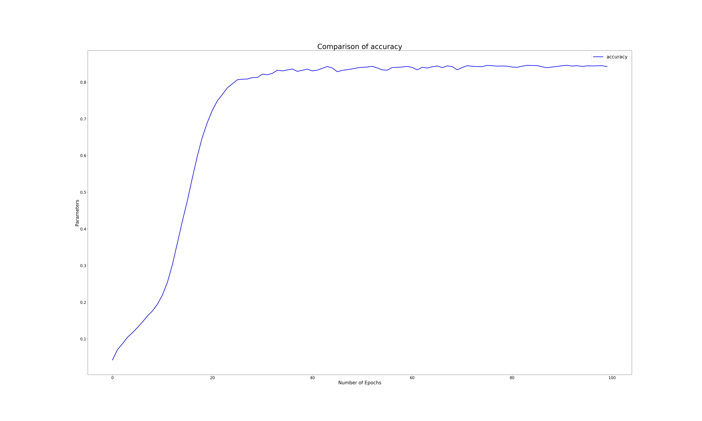
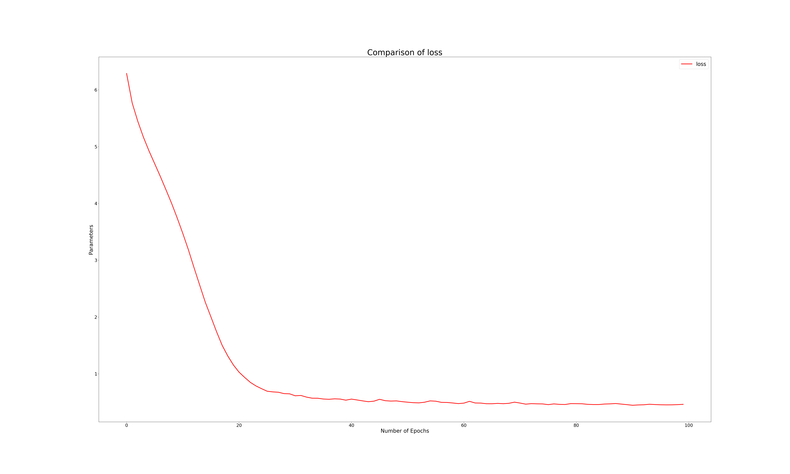

# Sentence-Completion-NLP-using-TensorFlow
Sentence completion model on trained on Shakespeare's "The comedy of error's" using NLP in TensorFlow and Keras

**Contents**
- About
- Conclusions
- Dataset
- Classes
- Executables
- Results

**About** 
I did this project to demonstrate my interpretation of a simple recurrent neural network model for sentence prediction using Bi-directional LSTM cells.
I have used TensorFLow 2.0 as a Machine Learning framework for this project to build the model and trained the model on a dataset from MIT. The build is object oriented and the executables are written as scripts.

**Conclusions**
1. The sentence prediction model performs well on avoiding repetitions of words even in longer sentences as the model is a RNN using Bi-directional LSTM cells.
2. The model fails to maintain the sentiment and meaning for longer sentences ~> 10 words.
3. Further look into maitaining the meaning for longer sentence is required to improve the model and make it more sophisticated.

**Dataset**
- [The comedy of error's](http://shakespeare.mit.edu/comedy_errors/full.html)

**Classes**
- DataPreprocessing : Dataset processing class to preprocessing raw data, tokenize, form input sequences and labels for training and prediction
- BuildModel : model class for the neural network NLP model
- PlotCode: Class for plotting the metrics from the trained model

**Executables**
- TrainModel : Trains the model on the training dataset
    - Model parameters used in training
        1. embedding dimensions = 256
        2. first LSTM layer units = 256
        3. second LSTM layer units = 128
        4. fully connected hidden layer neurons = TOTAL_WORDS

- Predict : Predicts the next words of the sentence on the seed text using the pretrained model

**Results**
- Accuracy and loss of the model on training dataset
- 
- 
- Results on Predict
    1. Seed text = "To quit"
        - Number of next words to predict = 10
        - Sentence predicted = "To quit the penalty and to ransom him not no feast in"
    
    2. Seed text = "A joyful"
        - Number of next words to predict = 8
        - Sentence predicted = "A joyful mother of two goodly sons and holy one"
        - Number of next words to predict = 10
        - Sentence predicted = "A joyful mother of two goodly sons and holy one and i"

    3. Seed text = "That by"
        - Number of next words to predict = 10
        - Sentence predicted = "That by misfortunes was my life prolong'd besides it cry you it"
